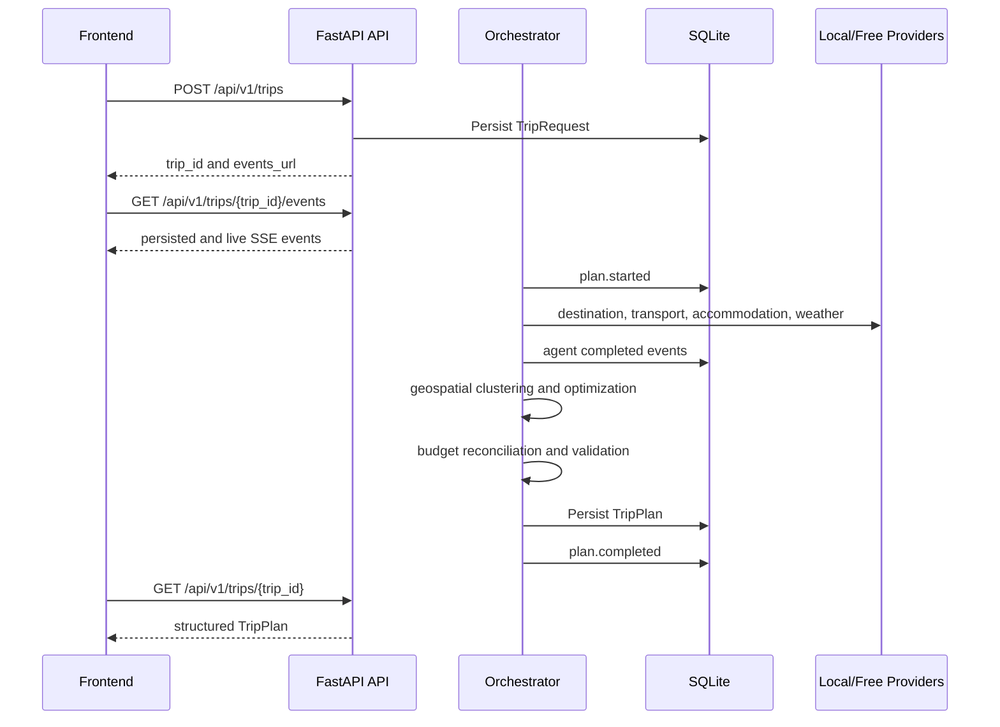

# Agent Flow

```mermaid
sequenceDiagram
    participant UI as Frontend
    participant API as FastAPI API
    participant ORCH as Orchestrator
    participant DB as SQLite
    participant PROV as Local/Free Providers

    UI->>API: POST /api/v1/trips
    API->>DB: Persist TripRequest
    API-->>UI: trip_id and events_url
    UI->>API: GET /api/v1/trips/{trip_id}/events
    API-->>UI: persisted and live SSE events
    ORCH->>DB: plan.started
    ORCH->>PROV: destination, transport, accommodation, weather
    ORCH->>DB: agent completed events
    ORCH->>ORCH: geospatial clustering and optimization
    ORCH->>ORCH: budget reconciliation and validation
    ORCH->>DB: Persist TripPlan
    ORCH->>DB: plan.completed
    UI->>API: GET /api/v1/trips/{trip_id}
    API-->>UI: structured TripPlan
```
