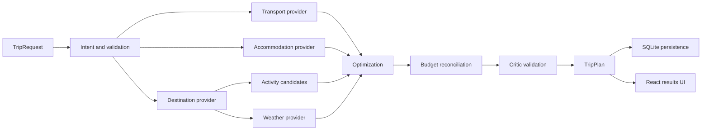

# Data Flow

```mermaid
flowchart LR
    A["TripRequest"] --> B["Intent and validation"]
    B --> C["Destination provider"]
    B --> D["Transport provider"]
    B --> E["Accommodation provider"]
    C --> F["Activity candidates"]
    C --> G["Weather provider"]
    D --> H["Optimization"]
    E --> H
    F --> H
    G --> H
    H --> I["Budget reconciliation"]
    I --> J["Critic validation"]
    J --> K["TripPlan"]
    K --> L["SQLite persistence"]
    K --> M["React results UI"]
```
